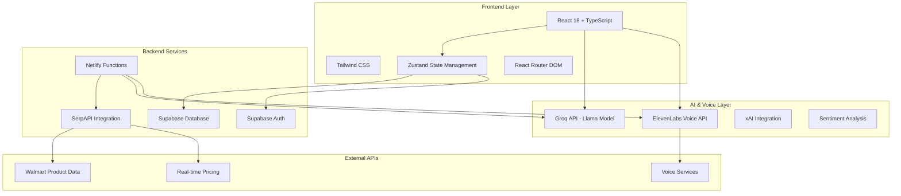
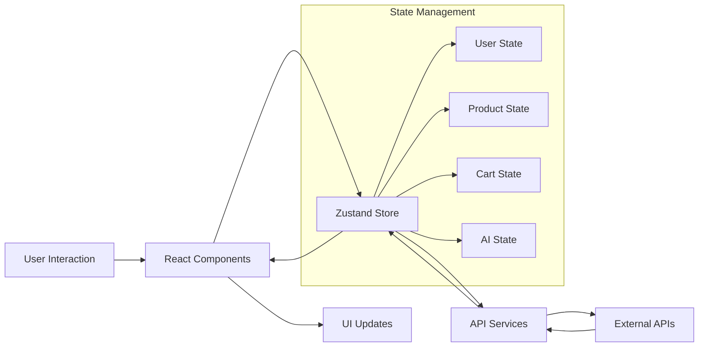

# Design Document

## Overview

CartifyAI is architected as a modern, scalable universal AI shopping assistant built with React 18, TypeScript, and a serverless backend. The system combines conversational AI, real-time product data, voice interaction, and intelligent recommendations to create a comprehensive shopping experience that can be embedded as a widget on any e-commerce platform.

The architecture follows a component-based design with centralized state management, leveraging modern web technologies for optimal performance and user experience. The system is designed to be platform-agnostic while demonstrating its capabilities through a Walmart-style interface.

## Architecture

### High-Level Architecture



### Component Architecture

The frontend follows a hierarchical component structure with clear separation of concerns:

- **App Layer**: Main application routing and global state initialization
- **Layout Components**: Header, navigation, and structural elements
- **Feature Components**: AI assistant, product display, cart management
- **UI Components**: Reusable interface elements and modals
- **Service Layer**: API clients and utility functions

### Data Flow Architecture



## Components and Interfaces

### Core Components

#### 1. CartifyAssistant Component
**Purpose**: Main conversational AI interface
**Key Features**:
- Real-time chat interface with message history
- Voice input/output integration
- Sentiment analysis and emotion intelligence
- Product recommendation engine
- Budget optimization suggestions

**Interface**:
```typescript
interface CartifyAssistantProps {
  isOpen: boolean
  onClose: () => void
  initialMessage?: string
}

interface Message {
  id: string
  content: string
  sender: 'user' | 'assistant'
  timestamp: Date
  sentiment?: 'positive' | 'negative' | 'neutral'
  products?: Product[]
  voiceEnabled?: boolean
}
```

#### 2. FloatingCartifyButton Component
**Purpose**: Universal widget entry point
**Key Features**:
- Customizable branding and positioning
- Notification indicators
- Responsive design for all screen sizes
- Integration hooks for third-party platforms

**Interface**:
```typescript
interface FloatingButtonProps {
  position?: 'bottom-right' | 'bottom-left' | 'top-right' | 'top-left'
  theme?: 'walmart' | 'custom'
  customColors?: ThemeColors
  showNotifications?: boolean
}
```

#### 3. ProductGrid and ProductCard Components
**Purpose**: Product display and interaction
**Key Features**:
- Real-time product data from SerpAPI
- Dynamic pricing updates
- Quick add-to-cart functionality
- AI-powered product recommendations
- Responsive grid layout

**Interface**:
```typescript
interface Product {
  id: string
  name: string
  description: string
  price: number
  original_price?: number
  image_url: string
  category_id: string
  stock_quantity: number
  rating: number
  review_count: number
  brand: string
  sku?: string
  is_featured?: boolean
}

interface ProductCardProps {
  product: Product
  onAddToCart: (product: Product, quantity: number) => void
  isRecommended?: boolean
  aiContext?: string
}
```

#### 4. Voice Integration Components
**Purpose**: Voice-enabled shopping experience
**Key Features**:
- Speech-to-text for product queries
- Text-to-speech for AI responses
- Voice command recognition
- Audio feedback and status indicators

**Interface**:
```typescript
interface VoiceControllerProps {
  onVoiceInput: (transcript: string) => void
  onVoiceOutput: (text: string) => void
  isListening: boolean
  isSpeaking: boolean
}

interface VoiceSettings {
  voice: string
  speed: number
  pitch: number
  volume: number
  language: string
}
```

### State Management Interfaces

#### Global Store Structure
```typescript
interface AppState {
  // User Management
  user: User | null
  userPreferences: UserPreferences
  
  // Product Data
  products: Product[]
  categories: Category[]
  searchResults: Product[]
  recommendations: Product[]
  
  // Shopping Cart
  cartItems: CartItem[]
  cartTotal: number
  
  // AI Assistant
  messages: Message[]
  aiContext: AIContext
  voiceSettings: VoiceSettings
  
  // UI State
  cartifyOpen: boolean
  voiceMode: boolean
  isLoading: boolean
  currentView: string
  
  // Search and Filters
  searchQuery: string
  selectedCategory: string
  priceRange: [number, number]
  sortBy: string
}
```

#### AI Context Interface
```typescript
interface AIContext {
  conversationHistory: Message[]
  userIntent: string
  currentBudget?: number
  preferredCategories: string[]
  sentimentHistory: SentimentData[]
  recommendationContext: RecommendationContext
}

interface RecommendationContext {
  recentlyViewed: Product[]
  purchaseHistory: Product[]
  currentCartItems: CartItem[]
  budgetConstraints?: BudgetConstraints
}
```

### API Service Interfaces

#### AI Service Interface
```typescript
interface AIService {
  sendMessage(message: string, context: AIContext): Promise<AIResponse>
  analyzeSentiment(text: string): Promise<SentimentAnalysis>
  generateRecommendations(context: RecommendationContext): Promise<Product[]>
  optimizeBudget(cart: CartItem[], budget: number): Promise<BudgetOptimization>
}

interface AIResponse {
  message: string
  products?: Product[]
  actions?: AIAction[]
  sentiment: SentimentAnalysis
  confidence: number
}
```

#### Product Service Interface
```typescript
interface ProductService {
  searchProducts(query: string, filters?: SearchFilters): Promise<Product[]>
  getProductDetails(productId: string): Promise<Product>
  getRecommendations(userId: string, context: RecommendationContext): Promise<Product[]>
  updatePricing(productIds: string[]): Promise<PriceUpdate[]>
}
```

## Data Models

### Core Data Models

#### User Model
```typescript
interface User {
  id: string
  email: string
  full_name?: string
  avatar_url?: string
  created_at: Date
  preferences: UserPreferences
  shopping_history: ShoppingHistory[]
}

interface UserPreferences {
  preferred_categories: string[]
  budget_range: [number, number]
  voice_settings: VoiceSettings
  notification_preferences: NotificationSettings
  privacy_settings: PrivacySettings
}
```

#### Product Model
```typescript
interface Product {
  id: string
  name: string
  description: string
  price: number
  original_price?: number
  image_url: string
  category_id: string
  stock_quantity: number
  rating: number
  review_count: number
  brand: string
  sku?: string
  is_featured?: boolean
  attributes: ProductAttribute[]
  availability: AvailabilityInfo
}

interface ProductAttribute {
  name: string
  value: string
  type: 'color' | 'size' | 'material' | 'feature'
}
```

#### Cart Model
```typescript
interface CartItem extends Product {
  quantity: number
  cart_item_id: string
  added_at: Date
  ai_recommended?: boolean
  recommendation_reason?: string
}

interface Cart {
  id: string
  user_id: string
  items: CartItem[]
  total_amount: number
  discount_amount?: number
  tax_amount?: number
  created_at: Date
  updated_at: Date
}
```

#### AI Conversation Model
```typescript
interface Conversation {
  id: string
  user_id: string
  messages: Message[]
  context: AIContext
  created_at: Date
  updated_at: Date
}

interface Message {
  id: string
  conversation_id: string
  content: string
  sender: 'user' | 'assistant'
  timestamp: Date
  message_type: 'text' | 'voice' | 'product_recommendation' | 'action'
  metadata: MessageMetadata
}

interface MessageMetadata {
  sentiment?: SentimentAnalysis
  products?: Product[]
  actions?: AIAction[]
  voice_data?: VoiceData
}
```

### Database Schema

#### Supabase Tables Structure
```sql
-- Users table
CREATE TABLE users (
  id UUID PRIMARY KEY DEFAULT gen_random_uuid(),
  email TEXT UNIQUE NOT NULL,
  full_name TEXT,
  avatar_url TEXT,
  preferences JSONB DEFAULT '{}',
  created_at TIMESTAMP WITH TIME ZONE DEFAULT NOW()
);

-- Products table (cached from SerpAPI)
CREATE TABLE products (
  id TEXT PRIMARY KEY,
  name TEXT NOT NULL,
  description TEXT,
  price DECIMAL(10,2) NOT NULL,
  original_price DECIMAL(10,2),
  image_url TEXT,
  category_id TEXT,
  stock_quantity INTEGER DEFAULT 0,
  rating DECIMAL(3,2) DEFAULT 0,
  review_count INTEGER DEFAULT 0,
  brand TEXT,
  sku TEXT,
  is_featured BOOLEAN DEFAULT FALSE,
  attributes JSONB DEFAULT '[]',
  created_at TIMESTAMP WITH TIME ZONE DEFAULT NOW(),
  updated_at TIMESTAMP WITH TIME ZONE DEFAULT NOW()
);

-- Cart items table
CREATE TABLE cart_items (
  id UUID PRIMARY KEY DEFAULT gen_random_uuid(),
  user_id UUID REFERENCES users(id) ON DELETE CASCADE,
  product_id TEXT NOT NULL,
  quantity INTEGER NOT NULL DEFAULT 1,
  name TEXT NOT NULL,
  price DECIMAL(10,2) NOT NULL,
  image_url TEXT,
  brand TEXT,
  ai_recommended BOOLEAN DEFAULT FALSE,
  recommendation_reason TEXT,
  created_at TIMESTAMP WITH TIME ZONE DEFAULT NOW()
);

-- Conversations table
CREATE TABLE conversations (
  id UUID PRIMARY KEY DEFAULT gen_random_uuid(),
  user_id UUID REFERENCES users(id) ON DELETE CASCADE,
  context JSONB DEFAULT '{}',
  created_at TIMESTAMP WITH TIME ZONE DEFAULT NOW(),
  updated_at TIMESTAMP WITH TIME ZONE DEFAULT NOW()
);

-- Messages table
CREATE TABLE messages (
  id UUID PRIMARY KEY DEFAULT gen_random_uuid(),
  conversation_id UUID REFERENCES conversations(id) ON DELETE CASCADE,
  content TEXT NOT NULL,
  sender TEXT NOT NULL CHECK (sender IN ('user', 'assistant')),
  message_type TEXT DEFAULT 'text',
  metadata JSONB DEFAULT '{}',
  created_at TIMESTAMP WITH TIME ZONE DEFAULT NOW()
);
```

## Error Handling

### Error Handling Strategy

#### 1. API Error Handling
```typescript
interface APIError {
  code: string
  message: string
  details?: any
  timestamp: Date
  request_id?: string
}

class ErrorHandler {
  static handleAPIError(error: APIError): UserFriendlyError {
    switch (error.code) {
      case 'RATE_LIMIT_EXCEEDED':
        return {
          message: 'Too many requests. Please try again in a moment.',
          action: 'retry_later',
          retryAfter: 60000
        }
      case 'PRODUCT_NOT_FOUND':
        return {
          message: 'Product not available. Let me suggest alternatives.',
          action: 'show_alternatives'
        }
      case 'AI_SERVICE_UNAVAILABLE':
        return {
          message: 'AI assistant temporarily unavailable. You can still browse products.',
          action: 'fallback_mode'
        }
      default:
        return {
          message: 'Something went wrong. Please try again.',
          action: 'retry'
        }
    }
  }
}
```

#### 2. Voice Service Error Handling
```typescript
interface VoiceErrorHandler {
  handleSpeechRecognitionError(error: SpeechRecognitionError): void
  handleTextToSpeechError(error: TTSError): void
  provideFallbackOptions(): FallbackOption[]
}

class VoiceErrorHandler implements VoiceErrorHandler {
  handleSpeechRecognitionError(error: SpeechRecognitionError): void {
    switch (error.type) {
      case 'no-speech':
        this.showMessage('No speech detected. Please try speaking again.')
        break
      case 'audio-capture':
        this.showMessage('Microphone access denied. Please enable microphone permissions.')
        break
      case 'network':
        this.showMessage('Network error. Switching to text input.')
        this.enableTextFallback()
        break
    }
  }
}
```

#### 3. Graceful Degradation
```typescript
interface FallbackStrategy {
  aiServiceFallback(): void
  voiceServiceFallback(): void
  productDataFallback(): void
  authenticationFallback(): void
}

class GracefulDegradation implements FallbackStrategy {
  aiServiceFallback(): void {
    // Switch to basic search functionality
    this.enableBasicSearch()
    this.showNotification('AI assistant temporarily unavailable. Basic search enabled.')
  }
  
  voiceServiceFallback(): void {
    // Disable voice features, enable text-only mode
    this.disableVoiceFeatures()
    this.enableTextOnlyMode()
  }
  
  productDataFallback(): void {
    // Use cached product data
    this.loadCachedProducts()
    this.showNotification('Using cached product data. Some information may be outdated.')
  }
}
```

## Testing Strategy

### Testing Architecture

#### 1. Unit Testing
```typescript
// Component Testing with React Testing Library
describe('CartifyAssistant', () => {
  test('should render chat interface', () => {
    render(<CartifyAssistant isOpen={true} onClose={jest.fn()} />)
    expect(screen.getByRole('textbox')).toBeInTheDocument()
  })
  
  test('should handle voice input', async () => {
    const mockVoiceInput = jest.fn()
    render(<CartifyAssistant onVoiceInput={mockVoiceInput} />)
    // Test voice functionality
  })
})

// Store Testing
describe('useStore', () => {
  test('should add product to cart', () => {
    const { result } = renderHook(() => useStore())
    act(() => {
      result.current.addToCart(mockProduct, 1)
    })
    expect(result.current.cartItems).toHaveLength(1)
  })
})
```

#### 2. Integration Testing
```typescript
// API Integration Tests
describe('AI Service Integration', () => {
  test('should get product recommendations', async () => {
    const recommendations = await aiService.generateRecommendations(mockContext)
    expect(recommendations).toHaveLength(5)
    expect(recommendations[0]).toHaveProperty('id')
  })
})

// Voice Service Integration
describe('Voice Service Integration', () => {
  test('should convert speech to text', async () => {
    const transcript = await voiceService.speechToText(mockAudioData)
    expect(transcript).toBe('show me laptops under 500 dollars')
  })
})
```

#### 3. End-to-End Testing
```typescript
// E2E Testing with Playwright
describe('Shopping Flow', () => {
  test('complete shopping journey', async ({ page }) => {
    await page.goto('/')
    await page.click('[data-testid="cartify-button"]')
    await page.fill('[data-testid="chat-input"]', 'I need a laptop for work')
    await page.click('[data-testid="send-button"]')
    await expect(page.locator('[data-testid="product-recommendations"]')).toBeVisible()
    await page.click('[data-testid="add-to-cart"]:first-child')
    await page.click('[data-testid="checkout-button"]')
    await expect(page).toHaveURL('/checkout')
  })
})
```

#### 4. Performance Testing
```typescript
// Performance Monitoring
interface PerformanceMetrics {
  aiResponseTime: number
  productLoadTime: number
  voiceProcessingTime: number
  pageLoadTime: number
}

class PerformanceMonitor {
  measureAIResponseTime(): Promise<number> {
    const start = performance.now()
    return aiService.sendMessage('test').then(() => {
      return performance.now() - start
    })
  }
  
  measureProductLoadTime(): Promise<number> {
    const start = performance.now()
    return productService.searchProducts('test').then(() => {
      return performance.now() - start
    })
  }
}
```

### Testing Coverage Requirements

- **Unit Tests**: 90% code coverage for components and utilities
- **Integration Tests**: All API endpoints and external service integrations
- **E2E Tests**: Critical user journeys and shopping flows
- **Performance Tests**: Response time benchmarks and load testing
- **Accessibility Tests**: WCAG 2.1 AA compliance
- **Cross-browser Tests**: Chrome, Firefox, Safari, Edge compatibility
- **Mobile Tests**: iOS Safari, Android Chrome responsive behavior

### Continuous Testing Pipeline

```yaml
# GitHub Actions Testing Pipeline
name: Test Suite
on: [push, pull_request]

jobs:
  unit-tests:
    runs-on: ubuntu-latest
    steps:
      - uses: actions/checkout@v3
      - name: Run unit tests
        run: npm run test:unit
      
  integration-tests:
    runs-on: ubuntu-latest
    steps:
      - uses: actions/checkout@v3
      - name: Run integration tests
        run: npm run test:integration
        
  e2e-tests:
    runs-on: ubuntu-latest
    steps:
      - uses: actions/checkout@v3
      - name: Run E2E tests
        run: npm run test:e2e
        
  performance-tests:
    runs-on: ubuntu-latest
    steps:
      - uses: actions/checkout@v3
      - name: Run performance tests
        run: npm run test:performance
```

This comprehensive design document provides the architectural foundation for implementing all the requirements in the CartifyAI system, ensuring scalability, maintainability, and optimal user experience across all platforms and use cases.